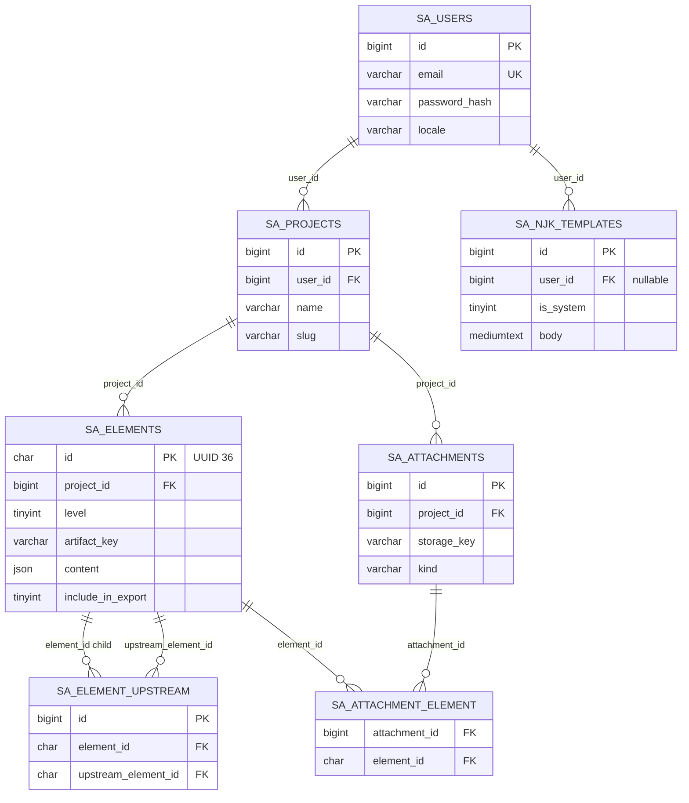

# Техническое задание  
# Веб-платформа «Карта работы системного аналитика» (it-senior.kz)

**Версия документа:** 1.9  
**Дата:** 2026-04-11  
**Основание:** замысел заказчика; материалы `docs/reference/system_analyst_map.md`, `contracts/sa_map_contract.json`, `templates/template.njk`; опыт прототипа `prototype/index.html`; ограничения хостинга (см. `docs/hosting/it-senior.kz.md` без учётных данных); переписка с Gemini (`docs/Переписка_с_Gemini.md`).

---

## 1. Цель и назначение

Разработать и внедрить веб-приложение для ведения **полной карты системного аналитика по задаче/проекту** (уровни L1–L10 в логике документа `system_analyst_map.md`): структурированный ввод данных, хранение по пользователям, работа с вложениями (PNG, файлы схем), предпросмотр, экспорт **данных** и экспорт **Markdown ТЗ** через шаблоны **Nunjucks (NJK)**.

Точка входа с основного сайта **IT Senior** (WordPress на домене it-senior.kz) должна быть добавлена **без разрушения** текущей структуры и контента корпоративного сайта — как отдельный **проект/раздел/страница** со ссылкой на приложение.

---

## 2. Контекст и проблемы предыдущей итерации

### 2.1. Ожидания по содержанию карты

Эталон содержания уровней, артефактов, чек-листов и анти-паттернов — документ **`system_analyst_map.md`**. Продукт должен опираться на эту модель (в том числе для полей, подсказок и проверок полноты), а не на сокращённый набор уровней или полей.

### 2.2. Прототип `index.html` (текущее состояние)

Реализовано частично:

- Условная «авторизация» по имени пользователя и хранение в `localStorage` браузера (без сервера, без пароля).
- Список проектов и черновой CRUD проектов в локальном хранилище.
- Редактор уровней **только для L1–L2** (конфигурация `LEVELS` не покрывает L3–L10).
- Библиотека шаблонов NJK в `localStorage`, модальное окно редактирования.
- Экспорт JSON активного проекта одним файлом; кнопка «Сохранить» дублирует запись в `localStorage`.

Не реализовано относительно целевого замысла:

- Регистрация и безопасная аутентификация, серверное хранение.
- Изолированные данные пользователей на сервере.
- Полное покрытие **L1–L10** в соответствии с `system_analyst_map.md`.
- **Привязка файлов** (PNG, экспорты схем BPMN/C4/UML и др.), предпросмотр вложений.
- Экспорт **каталога** или **архива** с JSON и файлами.
- Кнопка **«Сохранить MD»**: выбор шаблона NJK, рендеринг в Markdown и упаковка с ресурсами.

### 2.3. Риск регрессии функциональности (требование заказчика)

В ходе доработок предыдущего прототипа отмечалась **деградация**: при добавлении новых возможностей терялась уже реализованная функциональность. Для новой разработки это **недопустимо**.

**Требование:** в ТЗ и в процессе разработки предусмотреть:

- Модульную архитектуру и явные границы подсистем (аутентификация, проекты, уровни L1–L10, вложения, экспорт, шаблоны).
- Регрессионные проверки (автоматизированные и ручные чек-листы) перед каждым релизом.
- Версионирование API и схемы данных; обратная совместимость при изменении формата JSON.

---

## 3. Целевая аудитория и роли

| Роль | Описание |
|------|----------|
| Гость | Видит маркетинговую/входную информацию (по политике сайта), может зарегистрироваться или войти. |
| Пользователь (аналитик) | Личный кабинет: только **свои** проекты и шаблоны, CRUD, вложения, экспорт. |
| Администратор (опционально, этап 2) | Управление пользователями, мониторинг, резервное копирование (при необходимости). |

---

## 4. Интеграция с сайтом WordPress (it-senior.kz)

### 4.1. Ограничения среды (из материалов хостинга)

- Виртуальный хостинг, корень сайта: **httpdocs**; PHP (актуальная ветка по панели), **MariaDB**, SSL.
- Развёртывание типично через **FTP** и панель (**Plesk**); прямой **SSH** может быть недоступен — планировать деплой без обязательности CLI на сервере.

### 4.2. Канонический URL приложения

**Зафиксировано:** публичный адрес продакшн-приложения — **`https://it-senior.kz/sa-map/`** (подкаталог основного домена).

- Файлы приложения размещаются на сервере в **`httpdocs/sa-map/`** (или эквивалент корня сайта в Plesk).
- Конфигурация приложения: базовый URL **`APP_URL=https://it-senior.kz/sa-map`** (без обязательного завершающего слэша — по соглашению кода).
- WordPress остаётся в корне домена; таблицы и файлы WP **не** пересекаются с приложением (см. п. 6.1).
- Конфликты с правилами перезаписи WordPress (корневой `.htaccess`): каталог `sa-map/` обслуживается веб-сервером напрямую; при 404 внутри приложения — свой `.htaccess` в `sa-map/` (шаблон — в репозитории приложения).

### 4.3. Встраивание в меню и контент WordPress

Приложение **не** является плагином WP; связь — через **ссылки** и **пункты меню**.

| Способ | Действие |
|--------|----------|
| **Пункт главного меню** | Админка WP: **Внешний вид → Меню** → выбрать нужное меню (например «Основное») → слева блок **«Произвольные ссылки»** → **URL:** `https://it-senior.kz/sa-map/` → **текст ссылки:** например «Карта аналитика» → **Добавить в меню** → перетащить пункт в нужное место → **Сохранить меню**. |
| **Открытие в новой вкладке** | В списке пунктов меню раскрыть пункт «Карта аналитика» → включить **«Открывать в новой вкладке»** (если тема/плагин поддерживает; иначе — плагин типа «Menu Items Visibility» или правка темы). |
| **Страница-обёртка** | Создать страницу WP с описанием сервиса и кнопкой «Перейти» на тот же URL — полезно для SEO и пояснения перед входом в приложение. |
| **Виджет / подвал** | **Внешний вид → Виджеты** или редактор блоков: блок «Произвольный HTML» или «Кнопка» со ссылкой на `https://it-senior.kz/sa-map/`. |

**Технически:** пункт меню ведёт на **внешний** с точки зрения WP путь (другой «контент» не в БД страниц WP), но физически это тот же домен — куки SameSite обычно допускают сценарий «с сайта компании → в приложение»; отдельная авторизация приложения сохраняется (см. п. 6.1).

---

## 5. Функциональные требования

### 5.1. Аутентификация и регистрация

- Формы **входа** и **регистрации** (email/логин по решению проектировщика; пароль с требованиями к сложности).
- Восстановление пароля (рекомендуется).
- Сессии безопасно (HTTP-only cookies, CSRF-защита форм, защита от перебора паролей).
- После успешного входа — переход в **личный кабинет**.

### 5.1.1. Локализация интерфейса

- Требуется **локализация UI** на три языка: **русский (RU)**, **английский (EN)**, **казахский (KZ)**.
- Пользователь выбирает язык интерфейса (профиль, переключатель в шапке или эквивалент); выбор сохраняется для учётной записи и/или браузера.
- Подлежат переводу: навигация, подписи полей, сообщения об ошибках, кнопки, подсказки по карте (контент **проектов** и **экспортируемые** ТЗ остаются на языке ввода пользователя, если отдельно не оговорено).

### 5.2. Личный кабинет пользователя

- **Изоляция данных:** пользователь A не имеет доступа к проектам и файлам пользователя B (проверка на уровне API и БД).
- Отображение:
  - перечень **проектов** (создание, переименование, удаление — по согласованным правилам);
  - ссылка/раздел **«Библиотека шаблонов NJK»** (см. п. 5.5).

### 5.3. Проект (сущность «задача системного анализа»)

- **CRUD** проектов в рамках учётной записи.
- Для каждого проекта — работа с **уровнями L1–L10** в соответствии с логикой и терминологией `system_analyst_map.md` (поля, списки, текстовые блоки; где уместно — чек-листы и подсказки из документа). Полный перечень артефактов и правила управления ими — **п. 12**. Связь каждого уровня с предыдущим — **п. 5.3.2**.
- Сохранение черновиков на сервере с индикацией статуса сохранения и времени последнего изменения.

### 5.3.1. Включение артефактов в выгрузки («Сохранить данные» и «Сохранить MD»)

- Каждый **артефакт** в карте (единица содержания в рамках уровня: именованное поле данных, блок чек-листа, блок анти-паттернов, отдельная привязка вложения и т.п. — детальная гранулярность фиксируется в проектной модели, но принцип единый) сопровождается **флажком (галочкой)** вида: **включать / не включать** данный артефакт в итоговые выгрузки.
- Флаг действует **одинаково** для обеих операций: кнопки **«Сохранить данные»** и **«Сохранить MD»** — в состав экспорта попадают только артефакты с **включённой** галочкой; исключённые артефакты **не попадают** ни в JSON/файлы пакета «Сохранить данные», ни в сформированный Markdown и сопутствующие файлы пакета «Сохранить MD».
- **Вложения:** файлы (PNG, схемы и др.), относящиеся только к исключённым артефактам, в соответствующую выгрузку **не включаются**. Если один и тот же файл логически связан с несколькими артефактами, правило включения в архив: файл попадает в выгрузку, если **включён хотя бы один** из связанных артефактов (иначе — не попадает).
- Значение по умолчанию для нового артефакта: **включено в выгрузки** (при необходимости — массовое «включить всё / исключить всё» на уровне проекта или уровня L1–L10 как вспомогательная функция UI).
- Состояние галочек хранится в данных проекта и участвует в сериализации JSON (см. п. 6.4–6.6).

### 5.3.2. Межуровневая трассировка (основание на предыдущем уровне)

**Принцип (согласуется с `system_analyst_map.md` и практикой сквозной трассировки):** содержание уровней **L2–L10** логически **опирается** на результаты **предыдущего** уровня; фиксация этой связи в данных обязательна для поддерживаемой карты и экспорта. Утверждение заказчика о необходимости **явно указывать, из каких элементов предыдущего уровня возникло текущее требование/запись** — **корректно**; на практике связь чаще **не одна-к-одному**, а **многие-ко-многим** (одна запись Ln может опираться на несколько записей L(n−1), и одна запись L(n−1) может порождать несколько записей Ln).

**Единица трассировки:** не «уровень целиком», а **элемент данных** с собственным стабильным **`elementId`** внутри проекта: строка списка требований, карточка эпика, отдельная диаграмма BPMN и т.д. Для артефактов с **одной** записью на проект (см. колонку **Множ.** = нет в п. 12) вся сущность считается **одним элементом** с одним `elementId`.

**Правила:**

1. **Уровень L1** не имеет «верхнего» источника внутри карты; поле ссылок для элементов L1 **пустое** или не отображается.
2. Для каждого **элемента** на уровнях **L2–L10** предусмотрено поле **`upstreamElementIds`**: массив идентификаторов **элементов уровня (N−1)** в том же проекте, на которых **основана** данная запись. **Множественность допускается и является нормой:** `0…*` ссылок (ноль — только в черновике или при осознанном пропуске; рекомендуется **предупреждение в UI** при публикации/экспорте, если трассировка пуста).
3. Ссылки **только на непосредственно предыдущий уровень** (N−1), без «перепрыгивания» через L(n−2) в одном шаге; сквозная цепочка L1→…→L10 восстанавливается **транзитивно** при обходе графа.
4. **Обратная навигация:** для элемента уровня (N−1) отображается список **зависимых** элементов уровня N (**downstream**), вычисляемый по тем же связям.
5. При **удалении** элемента на уровне (N−1) поведение согласуется в UI: запрет удаления при наличии downstream / предупреждение / каскадное снятие ссылок — **фиксируется в проектировании**, исключая «висячие» ID в данных.
6. Трассировка **входит** в JSON проекта и при необходимости **в выгрузки** «Сохранить данные» / «Сохранить MD» (если соответствующие элементы не отфильтрованы п. 5.3.1); шаблоны NJK могут выводить блок «обоснование / источники L(n−1)».
7. **UI — выражение в интерфейсе:**
   - Для типов артефактов с **несколькими** записями (п. 12, **Множ.** = да): стандартные действия **CRUD** (**добавить / изменить / удалить** запись) в виде кнопок или эквивалента на **каждой** строке или карточке элемента.
   - Для артефактов с **одной** записью на проект (**Множ.** = нет): одна форма редактирования содержимого элемента (без списка), при необходимости с явными **«Сохранить» / сброс** вместо отдельного «создать второй».
   - **У каждого элемента уровней L2–L10** (в списке или в единственной карточке) — отдельная зона **«Основание на уровне (N−1)»** / **«Связь с предыдущим уровнем»**: мультивыбор элементов L(n−1) (чипы, выпадающий список с поиском и т.п.), отображение выбранных источников и возможность их убрать. Это и есть визуальное размещение **требований/элементов предыдущего уровня** «возле» текущего артефакта (точнее — возле **конкретной записи** этого типа).
   - Дополнительно: фильтр по типу артефакта на L(n−1), поиск по тексту; опционально создание элемента Ln **из** карточки элемента L(n−1) с предзаполненной связью.

### 5.4. Вложения и «прищепка» (привязка файлов)

- Возможность для полей типа «путь к схеме» / «иллюстрация» **прикреплять файлы**:
  - изображения **PNG** (в т.ч. экспорты из Camunda, draw.io, StarUML и др.);
  - **файлы схем** в согласованных форматах (например `.bpmn`, `.drawio`, и др. — перечень форматов фиксируется в проекте).
- Хранение файлов в **персональном пространстве** пользователя (привязка к проекту и полю).
- **Предпросмотр:** для изображений — встроенный просмотр; для прочих форматов — имя, размер, скачивание (и опционально иконка типа).

### 5.5. Библиотека шаблонов Nunjucks (NJK)

- Библиотека состоит из двух частей:
  1. **Предустановленные шаблоны** (корпоративные, поставляемые с продуктом): режим **только чтение** — просмотр, выбор для предпросмотра и для **«Сохранить MD»**, без редактирования и удаления пользователем.
  2. **Пользовательские шаблоны**: полный **CRUD** (создание, изменение, удаление) в рамках учётной записи.
- Редактор с подсветкой синтаксиса (желательно), валидация обязательных полей имени файла.
- Связь шаблона с **контрактом данных**: шаблон опирается на структуру JSON проекта и `metadata.levels_config` (как в `template.njk`), согласованную со **схемой** `sa_map_contract.json` (с расширениями под вложения и пути).

### 5.6. Предпросмотр результата шаблона

- Предпросмотр **рендеринга** выбранного NJK-шаблона по текущим данным проекта (в браузере или через серверный рендер — техническое решение зафиксировать в проекте; для NJK типичны **nunjucks** на Node при сборке или **порт на PHP** / клиентский nunjucks.js).

### 5.7. Кнопка «Сохранить данные»

**Назначение:** выгрузить **пакет данных проекта** (с учётом включённых артефактов, п. 5.3.1) для резервного копирования и обмена.

- Сформировать **JSON** проекта, соответствующий утверждённой JSON Schema (база — `sa_map_contract.json`, расширенная под метаданные, вложения, ссылки на файлы), **содержащий только данные и ссылки, относящиеся к артефактам с включённой галочкой**; исключённые артефакты в JSON не включаются (либо помечаются как исключённые — предпочтительно **полное исключение** фрагментов данных для компактности и однозначности).
- Включить **прикреплённые файлы** только для **включённых в выгрузку** артефактов (и по правилу общих вложений из п. 5.3.1), с сохранением **логической структуры каталогов и подкаталогов** (согласовать корневое имя, например `project_<id>_<slug>/`).
- **Альтернатива одной папке:** один **архив** (ZIP), содержащий JSON и дерево файлов.
- Итог: **скачивание в браузере** (в каталог «Загрузки») — **один ZIP-архив** (если выбрана поставка архивом) или согласованный формат (минимум — ZIP как единый артефакт по умолчанию).

### 5.8. Кнопка «Сохранить MD»

**Назначение:** получить **Markdown-документ технического задания** системного аналитика и связанные файлы **только для артефактов, отмеченных как включаемые в выгрузку** (п. 5.3.1).

Пользовательский сценарий:

1. Выбрать **конкретный** шаблон NJK из библиотеки.
2. Система формирует **фильтрованный** JSON данных проекта (без исключённых артефактов) и набор **сопутствующих файлов** (PNG, схемы) по тем же правилам, что и для «Сохранить данные».
3. Данные и шаблон пропускаются через **движок Nunjucks**; результат — **один или несколько MD-файлов** (по умолчанию — один главный `README.md` или `tz.md` — зафиксировать в проекте). Шаблон должен корректно обрабатывать отсутствие исключённых блоков (пустые секции не дублировать или не выводить — согласовать с библиотекой NJK).
4. В Markdown **корректно размещаются ссылки** на файлы в каталоге (относительные пути внутри выгрузки).
5. Структура каталогов повторяет раскладку вложений; при необходимости — подпапки `assets/`, `diagrams/` и т.д. (согласовать в спецификации экспорта).
6. Упаковка в **ZIP** и **скачивание** в браузере.

Ограничение: если в шаблоне используются расширения Nunjucks, не поддерживаемые выбранным рендерером, это должно быть документировано и валидироваться при сохранении шаблона.

---

## 6. Модель данных, хранение и БД

### 6.1. Разделение данных корпоративного сайта и приложения карты

| Область | Где хранится | Примечание |
|---------|----------------|------------|
| Сайт **WordPress** (it-senior.kz): страницы, меню, контент компании, настройки WP | Существующая БД WordPress (например `itsenior_wordpress_*`), таблицы `wp_*` | **Не смешивать** с таблицами приложения карты; учётные записи WP и пользователей SA — **разные сущности**, если не реализована явная интеграция SSO. |
| Приложение **«Карта системного аналитика»**: пользователи SA, проекты, элементы, трассировка, вложения, пользовательские NJK | Отдельная БД **MariaDB** на том же хостинге (рекомендуется **отдельная схема/БД**, выделенный пользователь с правами только на неё) | Продакшн: БД **`itsenior_sa_map`**, пользователь БД совпадает с именем БД; параметры подключения и пароль — в **`docs/hosting/sa-map-database.md`** (файл с секретами не коммитить, см. `docs/hosting/README.md`). Файлы вложений — в **файловой системе** (см. п. 8), в БД — только метаданные и пути. |

Файлы, отдаваемые через веб, не хранятся внутри таблиц BLOB-ами (кроме исключений по политике продукта); путь к файлу — в `sa_attachments.storage_key`.

### 6.2. СУБД и соглашения

- **MariaDB** (совместимо с MySQL), кодировка **utf8mb4**, сравнение **utf8mb4_unicode_ci** (или эквивалент).
- Префикс таблиц приложения: **`sa_`** (ниже — логические имена; при деплое допускается общий префикс Plesk, тогда `prefix_sa_users` и т.д.).
- Первичные ключи: целочисленные **BIGINT AUTO_INCREMENT**, кроме **`sa_elements.id`** — **CHAR(36)** (UUID строкой) для стабильных ссылок в JSON и трассировке.
- Временные метки: **`created_at`**, **`updated_at`** (DATETIME или TIMESTAMP).

### 6.3. Перечень таблиц

| Таблица | Назначение |
|---------|------------|
| `sa_users` | Учётные записи пользователей приложения (не WP). |
| `sa_projects` | Проекты (задачи системного анализа) внутри пользователя. |
| `sa_elements` | Элементы данных по карте: уровень, тип артефакта, JSON-содержимое, флаг выгрузки. |
| `sa_element_upstream` | Связи трассировки: элемент Ln → элемент(ы) L(n−1). |
| `sa_attachments` | Метаданные файлов (схемы, PNG, документы) на диске. |
| `sa_attachment_element` | Связь вложение ↔ элемент (M:N для «общих» файлов, п. 5.3.1). |
| `sa_njk_templates` | Шаблоны Nunjucks: предустановленные (`user_id IS NULL`, `is_system=1`) и пользовательские. |

Опционально на этапе реализации: `sa_password_resets`, `sa_audit_log` — вне минимального перечня.

### 6.4. Структура таблиц (поля)

**`sa_users`**

| Поле | Тип | Описание |
|------|-----|----------|
| `id` | BIGINT PK AI | Идентификатор пользователя. |
| `email` | VARCHAR(255) UNIQUE NOT NULL | Логин / email. |
| `password_hash` | VARCHAR(255) NOT NULL | Хеш пароля (алгоритм по стандарту продукта). |
| `locale` | VARCHAR(10) DEFAULT 'ru' | Язык UI: ru, en, kk. |
| `created_at`, `updated_at` | DATETIME | Аудит. |

**`sa_projects`**

| Поле | Тип | Описание |
|------|-----|----------|
| `id` | BIGINT PK AI | Проект. |
| `user_id` | BIGINT NOT NULL FK → `sa_users.id` | Владелец. |
| `name` | VARCHAR(500) NOT NULL | Название. |
| `slug` | VARCHAR(200) NULL | Короткое имя для папок экспорта (уникальность в рамках `user_id` — в приложении). |
| `created_at`, `updated_at` | DATETIME | Аудит. |

**`sa_elements`**

| Поле | Тип | Описание |
|------|-----|----------|
| `id` | CHAR(36) PK | UUID элемента (`elementId` в API/JSON). |
| `project_id` | BIGINT NOT NULL FK → `sa_projects.id` | Проект. |
| `level` | TINYINT NOT NULL | 1…10. |
| `artifact_key` | VARCHAR(120) NOT NULL | Ключ типа артефакта (согласование с п. 12, например `L4_epic`). |
| `sort_order` | INT DEFAULT 0 | Порядок в списке одного типа. |
| `content` | JSON NOT NULL | Полезная нагрузка: текстовые поля, массивы, вложенные структуры по `artifact_key`. |
| `include_in_export` | TINYINT(1) NOT NULL DEFAULT 1 | Галочка п. 5.3.1 на уровне элемента (или наследование от типа — уточняется в реализации). |
| `created_at`, `updated_at` | DATETIME | Аудит. |

Индексы: `(project_id, level, artifact_key)`, `(project_id)`.

**`sa_element_upstream`**

| Поле | Тип | Описание |
|------|-----|----------|
| `id` | BIGINT PK AI | Суррогатный ключ связи. |
| `element_id` | CHAR(36) NOT NULL FK → `sa_elements.id` ON DELETE CASCADE | Потомок (Ln). |
| `upstream_element_id` | CHAR(36) NOT NULL FK → `sa_elements.id` ON DELETE RESTRICT или SET NULL по политике п. 5.3.2 | Источник на L(n−1). |

Уникальность: `UNIQUE(element_id, upstream_element_id)`. Индекс на `upstream_element_id` для обратного поиска downstream.

Ограничение целостности «уровень upstream = level−1» — в слое приложения (CHECK в MariaDB для уровней возможен, но громоздко).

**`sa_attachments`**

| Поле | Тип | Описание |
|------|-----|----------|
| `id` | BIGINT PK AI | Вложение. |
| `project_id` | BIGINT NOT NULL FK → `sa_projects.id` | Проект. |
| `storage_key` | VARCHAR(512) NOT NULL | Относительный путь/ключ в защищённом хранилище. |
| `original_name` | VARCHAR(500) NOT NULL | Исходное имя файла. |
| `mime_type` | VARCHAR(127) NULL | MIME. |
| `kind` | ENUM('scheme','png','document','other') | Классификация для UI и экспорта. |
| `size_bytes` | BIGINT NULL | Размер. |
| `created_at` | DATETIME | Загрузка. |

**`sa_attachment_element`**

| Поле | Тип | Описание |
|------|-----|----------|
| `attachment_id` | BIGINT NOT NULL FK → `sa_attachments.id` ON DELETE CASCADE | Файл. |
| `element_id` | CHAR(36) NOT NULL FK → `sa_elements.id` ON DELETE CASCADE | Элемент, к которому относится вложение. |

PK: `(attachment_id, element_id)`.

**`sa_njk_templates`**

| Поле | Тип | Описание |
|------|-----|----------|
| `id` | BIGINT PK AI | Шаблон. |
| `user_id` | BIGINT NULL FK → `sa_users.id` ON DELETE CASCADE | NULL = только системные предустановки. |
| `title` | VARCHAR(255) NOT NULL | Заголовок в библиотеке. |
| `filename` | VARCHAR(255) NOT NULL | Имя файла в экспорте (например `tz.njk`). |
| `body` | MEDIUMTEXT NOT NULL | Текст шаблона NJK. |
| `is_system` | TINYINT(1) NOT NULL DEFAULT 0 | 1 — только чтение для пользователя. |
| `created_at`, `updated_at` | DATETIME | Аудит. |

### 6.5. ER-диаграмма (логическая)

*На схеме связь `SA_ELEMENTS` → `SA_ELEMENT_UPSTREAM` показана дважды (роли «потомок» и «источник»); в БД это две FK в одной таблице связей.*

### 6.6. Контракт JSON (экспорт и API)

- Базовый контракт — **`sa_map_contract.json`**; расширить:
  - поля идентификации пользователя и проекта;
  - для каждого артефакта — признак **`includeInExport`** (или эквивалент): логическое значение «включать в выгрузки по кнопкам „Сохранить данные“ и „Сохранить MD“»; при экспорте в JSON выгрузки передаётся только подмножество с `true`, либо полная модель с флагами — **предпочтительно хранить полную модель в БД**, а **фильтровать** при формировании файлов выгрузки;
  - для каждого **элемента** данных (п. 5.3.2): **`elementId`** (совпадает с `sa_elements.id`), **`level`**, **`artifactKey`**, **`upstreamElementIds`**: массив `elementId` уровня (N−1), **неограниченной длины** (`0…*`);
  - секцию вложений: `{ id, originalName, mimeType, relativePath, linkedFieldKey, linkedArtifactIds[], linkedElementIds[] }` (для правила общих файлов из п. 5.3.1 и привязки к элементам);
  - версию формата (`schemaVersion`).
- Публичная **JSON Schema** в репозитории проекта; миграции при изменении версии.
- Сборка JSON из БД: JOIN `sa_elements` + `sa_element_upstream` + агрегация вложений через `sa_attachment_element`.

---

## 7. Нефункциональные требования

| Область | Требование |
|--------|------------|
| Безопасность | HTTPS; хеширование паролей; защита от XSS/CSRF/SQLi; ограничение размера загрузок; валидация типов файлов. |
| Производительность | Пагинация списков проектов; ленивая загрузка тяжёлых превью; разумные лимиты на размер архива. |
| Надёжность | Резервное копирование БД и файлового хранилища (режим согласовать с хостингом). |
| Аудит | Журналирование входа и критичных операций (опционально этап 2). |
| Совместимость | Современные браузеры (Chrome, Edge, Firefox — последние версии). |
| Квоты | На текущем этапе **лимитов** на число проектов и объём хранилища **нет**. После введения **тарифных планов** потребуются настраиваемые ограничения **по каждому тарифу** (проекты, диск, число шаблонов и т.д. — детализация на этапе монетизации). |

---

## 8. Технологический стек (**утверждено**)

| Слой | Решение |
|------|---------|
| **Backend** | **Laravel** (PHP **8.2+**), **MariaDB** — отдельная БД приложения (см. п. 6.1). |
| **Интерфейс** | **Серверные страницы:** шаблоны **Blade**, формы и навигация без отдельного SPA-фронта на первом этапе. |
| **Локализация UI** | Встроенные механизмы Laravel (lang-файлы) для **RU / EN / KZ**. |
| **Файлы вложений** | Хранилище на диске сервера (каталог вне публичного webroot или с контролем доступа); в БД — метаданные (п. 6). |
| **Экспорт MD (Nunjucks)** | Рендер **в браузере** (библиотека `nunjucks` JS) при нажатии «Сохранить MD» — без Node.js на хостинге; либо серверная генерация ZIP после клиентского рендера — детализация в коде. |

Обоснование и команды установки: **`docs/STACK.md`**.

**Критерий:** соответствие п. 5.7–5.8, развёртывание на существующем shared-хостинге с Plesk.

---

## 9. Этапы внедрения (предложение)

1. **MVP:** регистрация/вход, **локализация RU/EN/KZ** (п. 5.1.1), проекты, L1–L10 по полной модели карты, **межуровневая трассировка** (п. 5.3.2), **галочки включения артефактов в выгрузки** (п. 5.3.1), сохранение на сервере, загрузка PNG/файлов, предпросмотр, экспорт ZIP «Сохранить данные».
2. **Расширение:** библиотека NJK (предустановленные + пользовательские, п. 5.5), предпросмотр рендера, «Сохранить MD» в ZIP.
3. **Интеграция с WP:** страница-вход, SEO, аналитика (по желанию заказчика).
4. **Будущее (вне текущего объёма):** экспорт **PDF** после Markdown; **лимиты по тарифным планам** (см. п. 7).

---

## 10. Критерии приёмки (общие)

- Реализованы п. 5.1–5.5, **5.3.1**, **5.3.2** и п. 5.7 для MVP; п. 5.6–5.8 — для второй фазы, если разделены.
- **Трассировка:** у элементов L2–L10 можно задать **несколько** ссылок на элементы L(n−1); цепочка по уровням восстанавливается; пустые ссылки в черновике допустимы с предупреждением по политике продукта.
- Данные пользователей **не пересекаются** при тестировании с минимум двумя учётными записями.
- **Галочки артефактов:** при снятии включения с части артефактов содержимое этих артефактов и их файлы **отсутствуют** в ZIP «Сохранить данные» и в ZIP «Сохранить MD»; при включении обратно — снова присутствуют.
- Экспортированный ZIP из п. 5.7 открывается стандартными средствами; JSON валидируется по схеме.
- Экспорт из п. 5.8 содержит MD и **работающие** относительные ссылки на вложенные файлы при локальном распаковывании.
- При добавлении новых функций **регрессионный чек-лист** предыдущих сценариев проходит без сбоев.
- **Локализация:** переключение RU / EN / KZ меняет язык интерфейса; основные экраны и сообщения переведены.
- Для каждой строки перечня п. **12** доступны заявленные **CRUD**, **множественность** и **вложения** (файл схемы / PNG) согласно таблице.

---

## 11. Решения заказчика (ранее открытые вопросы)

| Вопрос | Решение |
|--------|---------|
| Локализация | **Да:** интерфейс на **RU, EN, KZ** (см. п. 5.1.1). |
| Лимиты проектов и хранилища | **Сейчас ограничений нет.** После **тарифных планов** — ограничения **по тарифам** (см. п. 7). |
| Библиотека NJK | **Предустановленные** (только чтение) **и** **пользовательские** шаблоны с CRUD (см. п. 5.5). |
| Экспорт PDF | **Не входит в текущий объём**; **в перспективе — нужен** (см. п. 9). |

---

## 12. Перечень артефактов по уровням и пометы реализации

Источник наименований — разделы **«### Артефакты»** в `system_analyst_map.md`. Дублирующийся блок **LEVEL 5** в источнике сведён в **один** уровень L5. Блоки **Senior Checklist** и **Анти-паттерны** в данный перечень **не входят** (могут реализовываться отдельно как справочные подсказки UI).

### 12.1. Условные обозначения столбцов

| Столбец | Значение |
|---------|----------|
| **CRUD** | **да** — допустимо создание, изменение и удаление **записи** артефакта в проекте; для монолитного текстового блока — редактирование содержимого как одной записи. **нет** — не применимо (не используется в модели). |
| **Множ.** | **да** — допустимо **несколько** однотипных элементов (списком, отдельными карточками). **нет** — одна запись или один связный блок на проект/уровень для данного типа. |
| **Файл** | Прикрепление **исходного файла схемы/модели** (`.bpmn`, `.drawio`, `.uml`, `.md`, архив и т.д. — расширяемый перечень в настройках). **опц.** — по желанию пользователя. **—** — не предусмотрено. |
| **PNG** | Прикрепление **растрового экспорта или скриншота** для предпросмотра и вставки в ТЗ. **опц.** — по желанию. **—** — не предусмотрено. |

*Примечание:* для артефактов-**диаграмм** штатно предполагаются **и Файл, и PNG**; для **чисто текстовых** — обычно **— / —**, с исключениями (BRD — внешний документ и т.п.).

### 12.2. LEVEL 1 — Business Strategy

| Артефакт | CRUD | Множ. | Файл | PNG |
|----------|------|-------|------|-----|
| Business Vision | да | нет | опц. | опц. |
| Business Goals | да | да | — | — |
| Business Objectives | да | да | — | — |
| KPIs / Success Metrics | да | да | — | — |
| Business Constraints | да | да | — | — |
| Priorities / Trade-offs | да | да* | — | — |
| Success Criteria (Definition of Success) | да | нет | — | — |
| Decision Rules | да | да | — | — |

*Уточнение по Priorities / Trade-offs:* допускается **список** записей или **один** структурированный текст — на усмотрение UI; столбец **Множ.** = да, если выбрана модель «список карточек».

### 12.3. LEVEL 2 — Business Requirements

| Артефакт | CRUD | Множ. | Файл | PNG |
|----------|------|-------|------|-----|
| BRD | да | нет | опц. | опц. |
| Business rules | да | да | — | — |
| Stakeholders | да | да | — | — |
| Business Requirements (формализованные) | да | да | — | — |
| Stakeholder Requirements | да | да | — | — |
| Constraints (регуляторка, сроки, бюджет) | да | да | — | — |
| Scope (включая in / out) | да | нет | опц. | опц. |
| Assumptions | да | да | — | — |
| Dependencies | да | да | — | — |

*В источнике «Business Rules» встречается в нескольких группах — в продукте **одна** сущность «Business rules» без дублирования полей.*

### 12.4. LEVEL 3 — Business Processes

| Артефакт | CRUD | Множ. | Файл | PNG |
|----------|------|-------|------|-----|
| BPMN (AS-IS / TO-BE) | да | да | да | да |
| Business Use Cases | да | да | опц. | опц. |
| Value Streams | да | да | опц. | опц. |
| Process Maps | да | да | да | да |
| Error Flows | да | да | опц. | опц. |
| Alternative Flows | да | да | опц. | опц. |
| System Boundaries | да | нет | опц. | да |
| External vs Internal interactions | да | да | опц. | опц. |

### 12.5. LEVEL 4 — Product Requirements

| Артефакт | CRUD | Множ. | Файл | PNG |
|----------|------|-------|------|-----|
| Epics | да | да | — | — |
| User Stories / Features | да | да | — | — |
| Acceptance Criteria | да | да | — | — |
| Definition of Done | да | да | — | — |
| Backlog (prioritized) | да | да | — | — |
| Traceability (связь с L2 / L3) | да | да | опц. | — |
| Dependencies (между задачами) | да | да | — | — |

### 12.6. LEVEL 5 — System Interaction

| Артефакт | CRUD | Множ. | Файл | PNG |
|----------|------|-------|------|-----|
| System Use Cases | да | да | опц. | опц. |
| Actors | да | да | — | — |
| External Systems | да | да | — | — |
| System boundary | да | нет | опц. | да |
| C4 Level 1 — System Context Diagram | да | да | да | да |
| System Use Case Diagrams | да | да | да | да |
| API interactions (high-level) | да | да | опц. | опц. |
| Events (publish/subscribe) | да | да | опц. | — |
| Data flows (input/output) | да | да | опц. | да |
| Integration points | да | да | — | — |
| Interaction patterns (sync / async) | да | да | — | — |

### 12.7. LEVEL 6 — System Behavior

| Артефакт | CRUD | Множ. | Файл | PNG |
|----------|------|-------|------|-----|
| Sequence Diagrams | да | да | да | да |
| Activity Diagrams | да | да | да | да |
| State Machine Diagrams | да | да | да | да |
| Communication Diagrams *(опционально в источнике)* | да | да | да | да |
| Error flows | да | да | опц. | опц. |
| Retry / timeout logic | да | да | — | — |
| Async flows | да | да | опц. | опц. |

### 12.8. LEVEL 7 — System Structure

| Артефакт | CRUD | Множ. | Файл | PNG |
|----------|------|-------|------|-----|
| Domain Models | да | нет | опц. | да |
| High-level Class Diagrams | да | да | да | да |
| ER Diagrams (логическая модель) | да | да | да | да |
| Detailed Class Diagrams | да | да | да | да |
| Entity Lifecycle | да | да | опц. | да |
| Package Diagrams | да | да | да | да |
| Object Diagrams *(дополнительно в источнике)* | да | да | да | да |

### 12.9. LEVEL 8 — System Architecture

| Артефакт | CRUD | Множ. | Файл | PNG |
|----------|------|-------|------|-----|
| C4 Level 2 — Container Diagram | да | да | да | да |
| C4 Level 3 — Component Diagram | да | да | да | да |
| UML Component Diagrams | да | да | да | да |
| Integration Diagrams | да | да | да | да |
| Data Flow Diagrams | да | да | опц. | да |
| Architecture Decision Records (ADR) | да | да | опц. | опц. |
| Interaction patterns (sync / async) | да | да | — | — |
| Data ownership map | да | нет | опц. | да |

### 12.10. LEVEL 9 — Infrastructure

| Артефакт | CRUD | Множ. | Файл | PNG |
|----------|------|-------|------|-----|
| Deployment Diagrams (UML) | да | да | опц. | да |
| Infrastructure Diagrams (Cloud / On-prem) | да | да | опц. | да |
| Cloud Architecture | да | нет | опц. | да |
| Kubernetes / Containers | да | нет | опц. | опц. |
| Network topology | да | нет | опц. | да |
| Load balancers | да | да | — | — |
| API gateways | да | да | — | — |
| Monitoring & Logging architecture | да | нет | опц. | да |
| CI/CD pipelines | да | да | опц. | опц. |
| Environment setup (dev / test / prod) | да | нет | опц. | — |

### 12.11. LEVEL 10 — Implementation

| Артефакт | CRUD | Множ. | Файл | PNG |
|----------|------|-------|------|-----|
| API: OpenAPI / REST | да | да | да | опц. |
| API: GraphQL | да | да | да | опц. |
| API: SOAP (WSDL) | да | да | да | опц. |
| Event schemas | да | да | да | — |
| Async contracts | да | да | да | — |
| DB schema (physical model) | да | нет | да | опц. |
| Migration scripts | да | да | да | — |
| DTO / Data contracts | да | да | опц. | — |
| Validation rules | да | да | — | — |
| Error models (ошибки API) | да | да | — | — |
| Versioning strategy | да | нет | опц. | — |

### 12.12. Связь с п. 5.3.1

Каждая **строка** таблиц п. 12.2–12.11 соответствует **типу артефакта** в смысле п. 5.3.1: для неё задаётся отдельная галочка **«включать в выгрузку»** (на уровне типа или агрегированно — по решению UI), независимо от соседних строк того же уровня.

### 12.13. Связь с п. 5.3.2 (трассировка)

Конкретные **элементы** (записи списков, карточки), создаваемые в рамках типов из п. 12.2–12.11, несут **`upstreamElementIds`** на элементы предыдущего уровня. **Множественность ссылок на один элемент Ln разрешена**; обратное отображение «кто ссылается» строится автоматически.

---

*Конец документа.*

